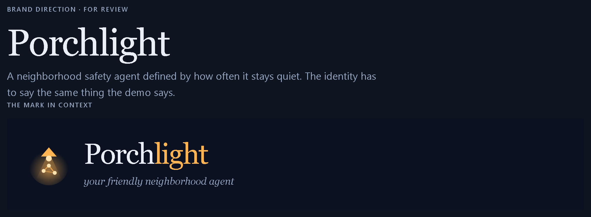
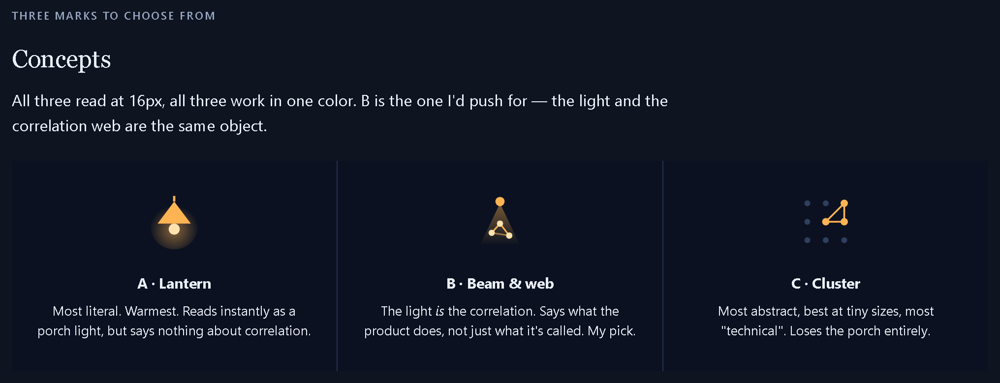
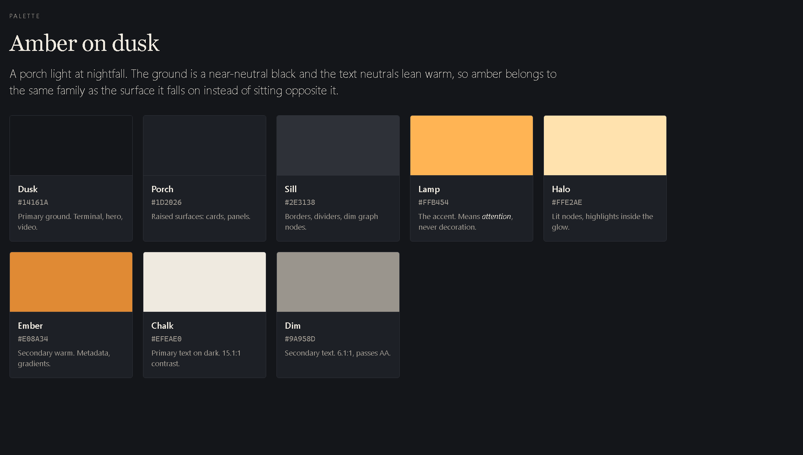
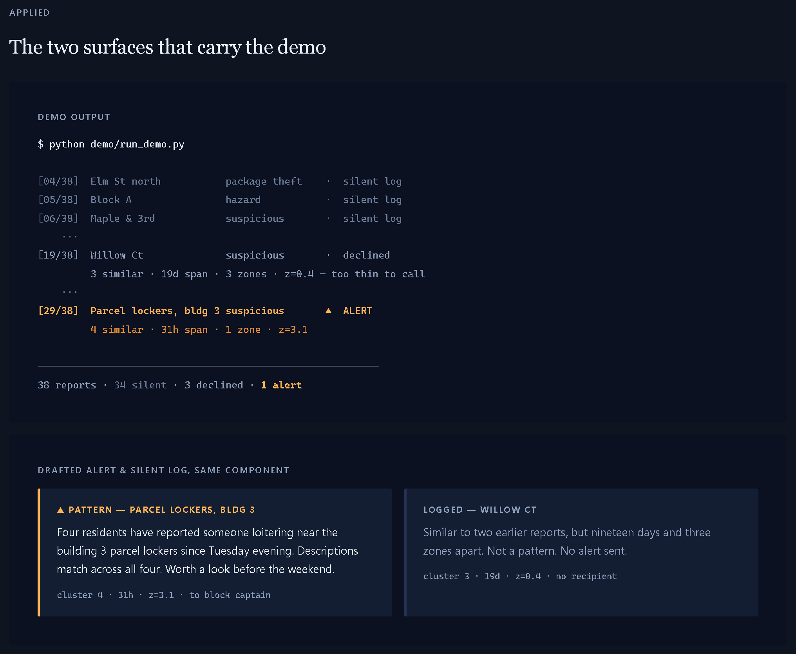
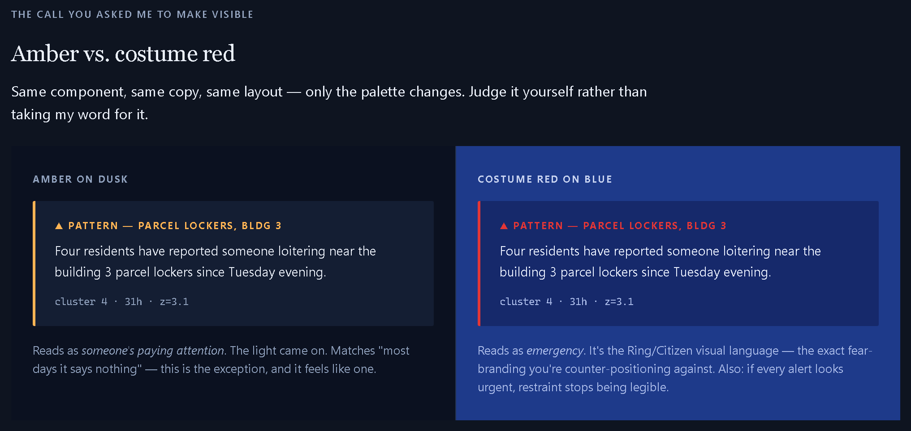
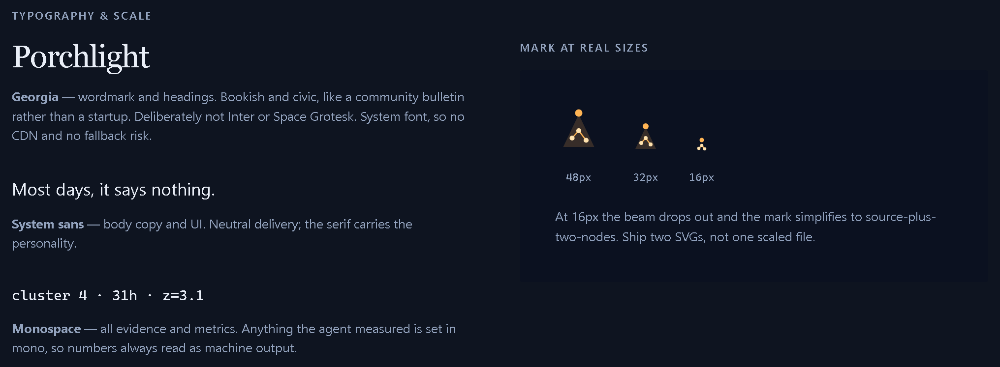
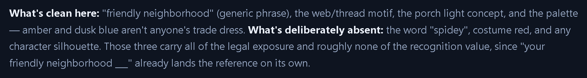

# Porchlight — Brand

> [!info] Related
> [[PROJECT_BRIEF]] · [[IMPLEMENTATION_PLAN]]

**Name:** Porchlight
**Tagline:** *your friendly neighborhood agent*

The name is the proper noun; the tagline is the joke. Splitting them keeps "Porchlight" usable as a repo name, a CLI binary, and a package name, while the reference still lands in the README's first line and the video's first five seconds.



---

## The organizing idea

Every product in this category brands on vigilance — red badges, alarm states, permanent alertness. Porchlight's claim is the opposite: **most days it says nothing.** The identity has to say the same thing the demo says, or the branding argues against the product.

So the accent color is semantic, not paint:

- **Dim = silently logged.** The common case — the large majority of the 38-report seed set.
- **Lit = the porch light came on.** The exception, and it should feel like one.


This one image is the README hero, the architecture diagram motif, and the video's cold open. Built once, used three times. The three mid-tone nodes are the near-miss — visibly similar, deliberately **not** linked. That's the most persuasive frame in the whole submission, so it earns its place in the logo motif too.

---

## Logo



**Chosen: Concept B — Beam & Web.** The light *is* the correlation, so the mark says what the product does rather than only what it's called. A is warmer but says nothing about correlation; C is the most technical but loses the porch entirely.

> [!warning] Ship two SVGs, not one scaled file
> At 16px the beam gradient drops out and the mark has to simplify to source-plus-two-nodes. A single scaled file turns to mud at favicon size. See the size specimen in [Typography](#typography--scale) below.

---

## Palette — amber on dusk

A porch light at nightfall. Every neutral carries a blue bias toward the ground, so nothing reads as generic grey.



| Token | Hex | Role |
|---|---|---|
| Dusk | `#0B1120` | Primary ground. Terminal, hero, video. |
| Porch | `#141E33` | Raised surfaces — cards, panels. |
| Sill | `#243352` | Borders, dividers, dim graph nodes. |
| Lamp | `#FFB454` | **The accent. Means *attention* — never decorative.** |
| Halo | `#FFE2AE` | Lit nodes, highlights inside the glow. |
| Ember | `#E08A34` | Secondary warm — metadata, gradients. |
| Chalk | `#E9EEF7` | Primary text on dark. 16:1 contrast. |
| Dim | `#8FA0BC` | Secondary text. 6.9:1 — passes AA. |

> [!important] The one rule that matters
> **Lamp never appears on anything that isn't an escalation.** Not on buttons, not on links, not on section headers, not as a decorative underline. The moment amber becomes decoration, the alert stops reading as an alert and the entire "restraint is the feature" argument collapses. If something needs emphasis and isn't an alert, use Chalk or Ember.

CSS custom properties, ready to paste:

```css
:root {
  --dusk:  #0B1120;
  --porch: #141E33;
  --sill:  #243352;
  --lamp:  #FFB454;
  --halo:  #FFE2AE;
  --ember: #E08A34;
  --chalk: #E9EEF7;
  --dim:   #8FA0BC;
}
```

---

## Applied



Two surfaces carry the whole demo, and they use the same rule:

1. **Terminal output.** Silent logs in `--dim`'s quieter cousin, declines in `--dim`, the single alert in `--lamp`. The summary line (`38 reports · N silent · N declined · 1 alert`) is the shot that makes the argument without narration. **Shoot whatever the run prints — the split between silent and declined depends on the model's calls and is not a fixed figure. Only the totals are: 38 in, exactly one alert out.**
2. **Alert and silent-log cards.** *Same component*, only the border and kicker color change. Amber left-border for a pattern, `--sill` for a log. Building them as one component with a variant — rather than two components — is what makes the restraint visible in the code as well as the UI.

Evidence strings (`cluster 4 · 31h · z=3.1`) are always monospace, always in the footer position.

---

## Amber vs. costume red

Recorded here because it was a real decision, not a default.



Same component, same copy, same layout — only the palette changes.

- **Amber on dusk** reads as *someone's paying attention*. The light came on.
- **Costume red on blue** reads as *emergency*. It is the Ring/Citizen visual language — the exact fear-branding this project is counter-positioning against. And if every alert looks urgent, restraint stops being legible at all.

The amber choice isn't a legal compromise. It's the better design, and it happens to also be clean.

---

## Typography & scale



- **Georgia** — wordmark and headings. Bookish and civic, like a community bulletin rather than a startup. Deliberately not Inter or Space Grotesk. System font, so no CDN and no fallback risk.
- **System sans** (`-apple-system, BlinkMacSystemFont, "Segoe UI", Roboto, …`) — body copy and UI. Neutral delivery; the serif carries the personality.
- **Monospace** (`ui-monospace, "Cascadia Code", "SF Mono", Consolas, …`) — all evidence and metrics. Anything the agent *measured* is set in mono, so numbers always read as machine output rather than as authored copy.

No webfonts anywhere. Every face above is a system font, which means zero network requests and no flash-of-unstyled-text in the demo video.

---

## Trademark scope



**Clean and in use:** "friendly neighborhood" (a generic English phrase), the web/thread motif, the porch light concept, and the palette — amber and dusk blue aren't anyone's trade dress.

**Deliberately absent:** the word "spidey", costume red, and any character silhouette or Marvel-derived font.

> [!note] Why this line, and not a stricter or looser one
> Those three excluded elements carry effectively all of the legal exposure and roughly none of the recognition value — "your friendly neighborhood ___" already lands the reference on its own. The concern was never a lawsuit; it was a platform takedown (GitHub, YouTube, or Devpost) landing inside the judging window, plus the IP warranty attached to a sponsored competition. Exposure scales with *winning*, which is the wrong direction for a risk to run.
>
> This supersedes the contradiction in [[PROJECT_BRIEF]] §11, which bans "Spidey" and then offers "spidey-sense for your neighborhood" as a safe framing four lines later. The ban is the correct half. Don't let the phrase back in through the video voiceover.

---

## Asset index

Rendered from the brand board at 2× device scale. Source: `assets/branding/`.

| File | Contents |
|---|---|
| `01-masthead.png` | Wordmark, mark, tagline |
| `02-graph-motif.png` | Correlation graph — the hero image |
| `03-logo-marks.png` | Three logo concepts |
| `04-palette.png` | Full palette with roles |
| `05-applied.png` | Terminal output + card pair |
| `06-amber-vs-red.png` | Palette comparison |
| `07-typography.png` | Type specimen + mark at 48/32/16px |
| `08-scope-note.png` | Trademark scope |

The interactive brand board (live SVG, selectable hex values) is published at
<https://claude.ai/code/artifact/b16f9e23-18fa-4c26-be3a-f533bf72ded7>

---

## Still open

- [ ] Repo/folder name — currently `friendly-neigh-agent`; [[PROJECT_BRIEF]] §8 says `friendly-neighborhood-agent`; "porchlight" is now the strongest candidate.
- [ ] Export the chosen mark as real SVG files: `assets/logo.svg` (full) and `assets/logo-16.svg` (simplified).
- [ ] Favicon `.ico`/`.png` from the 16px variant.
