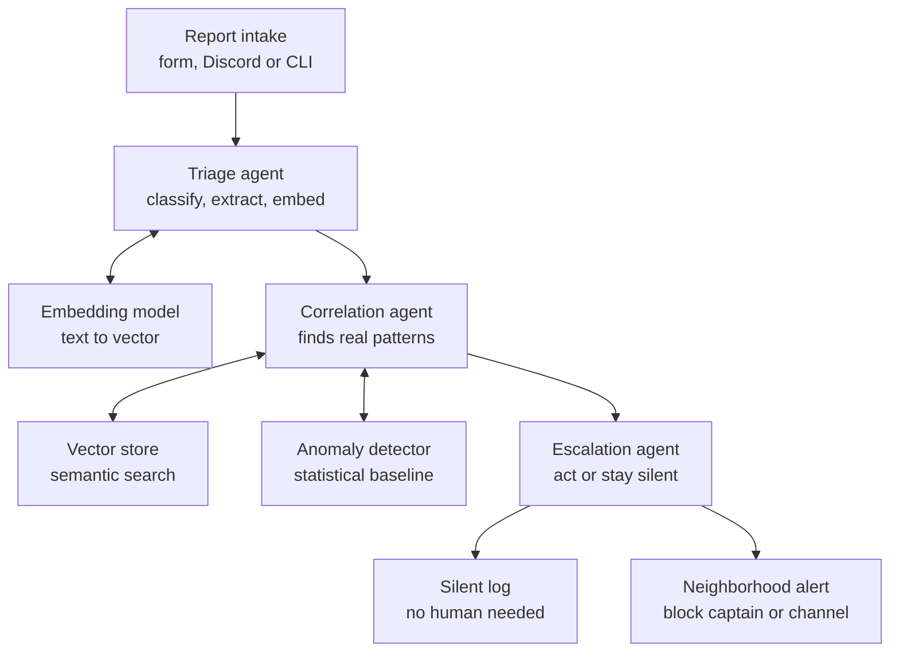

# Project brief — Friendly Neighborhood Agent

> Context document for Claude Code / Claude Cowork. Read this first before writing any code.
> This describes what we're building, why each design decision was made, and what is still undecided.

---

## 1. What this is

A submission for the **AWS "Agents for Humans" hackathon** (Devpost), built with the **Strands Agents SDK**.

**Track:** Good Neighbor Agents — agents that help groups of people, not just one individual.

**One-line pitch:** A background agent that watches a neighborhood's stream of package-theft and safety reports, works out which ones are connected, and only wakes a human when a real pattern is emerging.

**Working name:** Friendly Neighborhood Agent

**Deadline:** **Monday 14 September 2026, 5:00pm PT** — the submission close in the official rules. (This originally read "6 weeks from project start", which was a guess and was wrong. The AWS credits request form closes earlier, 11 September at 12pm PT.)

---

## 2. The problem

Neighborhoods already report things to each other — stolen packages, someone loitering near mailboxes, a car circling the block. The reports land in a Discord server, a WhatsApp group, a Nextdoor feed, an HOA email chain.

Three things go wrong:

1. **Every report is treated identically.** A one-off missing package and the third theft on the same street this week produce the same notification, so people tune all of them out.
2. **Nobody correlates.** The pattern is visible only if one person happens to read every message and remember them. That person doesn't exist, or burns out.
3. **Wording varies wildly.** "Guy hanging around the mailboxes," "suspicious dude by the post boxes," and "someone loitering near the parcel lockers" are the same event described three ways. Keyword matching misses all of it.

The result: real patterns get noticed late, and the channel becomes noise everyone mutes.

## 3. Who it's for

The person who runs a neighborhood's communication channel — a block captain, HOA coordinator, Discord mod for a local server, a building's residents' rep. Unpaid, volunteer, already overwhelmed. Secondarily, the residents who receive alerts and currently get too many of them.

## 4. Why it matters

Small-scale community safety is almost entirely volunteer-run and unsupported by tooling. The alternative to "someone reads every message" is nothing at all. An agent that quietly absorbs the routine reports and only interrupts on a genuine pattern gives a volunteer coordinator the attention budget of a full-time analyst.

This maps directly onto the hackathon's core framing: **runs autonomously in the background, only surfaces when there's a real decision to make.**

---

## 5. Architecture

### Flow

```
Report intake (form / Discord / CLI)
        │
        ▼
Triage agent ──────────────► Embedding model
  classify, extract, embed        (text → vector)
        │
        ▼
Correlation agent ─────────► Vector store (semantic search)
  finds real patterns  ─────► Anomaly detector (statistical baseline)
        │
        ▼
Escalation agent
  act or stay silent
        │
        ├──────────────► Silent log        (no human needed — the common case)
        └──────────────► Neighborhood alert (block captain or channel)
```

### Mermaid version (for the README / submission diagram)



### The three agents

Each is a separate Strands `Agent` with its own system prompt and its own narrow set of tools. This is deliberate — see §6.

**1. Triage agent**
- Input: one raw report (free text + zone + timestamp).
- Job: classify the report type (package theft / suspicious activity / vandalism / hazard / other), extract or confirm the zone and time, assign a rough severity, and generate an embedding of the description.
- Output: a structured record, written to both the report log and the vector store.
- Tools: `classify_report`, `store_report`, `embed_and_index`.

**2. Correlation agent**
- Input: the newly triaged record.
- Job: decide whether this report is connected to anything already known. Two independent signals:
  - **Semantic** — query the vector store for reports with similar descriptions, then filter to those within a time and zone window. This catches differently-worded descriptions of the same phenomenon.
  - **Statistical** — ask the anomaly detector whether this zone's current report rate is genuinely unusual against its own historical baseline.
- Output: a correlation summary — cluster size, time span, zones involved, anomaly score, and its own reasoning about whether this looks like a pattern or a coincidence.
- Tools: `semantic_search`, `check_baseline_deviation`, `get_zone_history`.

**3. Escalation agent**
- Input: the correlation summary.
- Job: the judgment call. Decide silent-log vs alert, and if alerting, decide urgency, audience, and draft the message.
- Output: either nothing (log only) or a drafted alert.
- Tools: `write_log_entry`, `draft_alert`, `send_alert`.

**Critical design rule:** the escalation decision lives in the LLM's reasoning, guided by the system prompt — not in a hardcoded `if count > 3` branch. The thresholds inform the decision; they don't make it. This is what separates an agent from a cron job, and it's what the Technical Implementation score is looking for.

---

## 6. Design decisions and why

### Why multi-agent instead of one agent with six tools

Strands supports both. Single-agent would work and would be simpler. Multi-agent was chosen because:

- Each agent's system prompt stays short and focused, which measurably improves reliability versus one prompt trying to govern classification, correlation, and escalation simultaneously.
- The escalation decision is isolated from the data-gathering, so it can't be biased by the mechanics of retrieval — it only sees the summary.
- It demonstrates understanding of agent *systems*, which is the differentiator in an agent-focused hackathon where most solo entries will be single-agent-with-tools.
- Strands has first-class support for this (Agent-as-Tool, Swarm patterns), so it's not fighting the SDK.

**Trade-off to stay aware of:** multi-agent is harder to debug. Handoffs can loop, agents can call each other redundantly, and a failure three agents deep is painful to trace. Budget time for this. Turn on Strands' built-in observability early rather than at the end.

### Why embeddings instead of keyword matching

The whole premise is that people describe the same event in different words. Keyword or regex matching fails on exactly the cases that matter most. Semantic similarity via embeddings is the minimum viable approach to the actual problem, not an ornament.

### Why statistical anomaly detection on top of semantic clustering

Semantic clustering answers "are these reports about the same kind of thing?" It does not answer "is this amount of activity unusual *for this area*?" A busy commercial block might normally get two reports a week; a quiet cul-de-sac getting two reports in a day is a much stronger signal. A fixed global threshold would over-alert the busy zone and under-alert the quiet one.

Approach: model each zone's report arrival rate against its own history (Poisson rate or a simple z-score over a rolling window), and surface the deviation as a score the correlation agent can reason about.

Keep this simple. It's a supporting signal, not the centerpiece. ~50 lines with numpy/scipy is the target.

### Why zones instead of real addresses

Reports are tagged to named zones ("Elm St north," "Block A," "Parcel lockers, building 3"), not street addresses or coordinates.

- Avoids a geocoding dependency and its API costs.
- Avoids putting anything resembling real address data in a public repo.
- A public safety tool that leaks resident addresses is a genuinely bad outcome, and judges will notice the choice.
- Zone granularity is sufficient for correlation — the pattern is "this stretch of street," not "this doorstep."

### Why synthetic data for the demo

There is no real neighborhood report dataset available, and using one would raise privacy problems. A seeded synthetic dataset is standard practice for this kind of demo and lets the demo be deterministic and reproducible.

Design the seed data deliberately: it should contain **at least one genuine cluster** (several semantically-similar reports, same zone, tight time window), **several isolated one-offs** that must be correctly ignored, and ideally **one near-miss** — reports that are similar but spread too thin in time or space to justify alerting. The near-miss is the most convincing thing in the whole demo, because it shows the agent declining to cry wolf.

---

## 7. Technical stack

- **Python 3.12+**
- **Strands Agents SDK** (`pip install strands-agents strands-agents-tools`) — current version 1.51.0
- **Model provider:** Anthropic API (Claude) or Amazon Bedrock. Bedrock is worth using given the $50 AWS credits and that this is an AWS hackathon.
- **Vector store:** ChromaDB (local, embedded, no server to run)
- **Anomaly detection:** numpy / scipy
- **Storage:** SQLite for the structured report log
- **Deployment (optional, scores extra):** AgentCore Runtime, or Lambda + EventBridge scheduled trigger

### Notes on Strands specifically

- Tools are plain Python functions with a `@tool` decorator. **The docstring is the tool's interface to the model** — it decides when and how to call the tool from the docstring alone. Write these carefully; a vague docstring is a bug.
- The agent loop is: model reads context → decides tool vs answer → calls tool → reads result → repeats. There is no workflow to define.
- Strands ships built-in OpenTelemetry observability. Enable it from day one — with three agents handing off, tracing is not optional.

---

## 8. Repository layout (proposed)

```
friendly-neighborhood-agent/
├── README.md                  # problem, architecture, setup, demo instructions
├── LICENSE                    # MIT — must be visible in repo About section
├── requirements.txt
├── architecture.png           # diagram, required by submission
├── src/
│   ├── agents/
│   │   ├── triage.py
│   │   ├── correlation.py
│   │   └── escalation.py
│   ├── tools/
│   │   ├── storage.py         # SQLite report log
│   │   ├── vectors.py         # ChromaDB indexing + semantic search
│   │   ├── anomaly.py         # baseline model + deviation scoring
│   │   └── alerts.py          # draft + dispatch
│   ├── intake/                # form / Discord / CLI adapter
│   └── pipeline.py            # orchestration entry point
├── data/
│   └── seed_reports.json      # synthetic demo dataset
└── demo/
    └── run_demo.py            # deterministic scripted demo run
```

---

## 9. Six-week plan

| Week | Goal |
|---|---|
| 1 | Strands basics. Single agent, one fake tool, running end to end. Repo + license + README skeleton. |
| 2 | Triage agent + SQLite storage + ChromaDB indexing. Seed dataset written. |
| 3 | Correlation agent. Semantic search working and visibly catching differently-worded duplicates. |
| 4 | Anomaly detector + escalation agent. Full three-agent pipeline running end to end. |
| 5 | Intake adapter (pick one), observability, error handling. Optional: AgentCore or Lambda deployment. |
| 6 | Demo video, architecture diagram, README polish, builder.aws post, submit. **Do not leave the video to the last two days.** |

**Scope discipline:** if week 4 is at risk, cut the Discord intake and demo from CLI. If week 5 is at risk, cut the deployment. Never cut the three-agent pipeline or the seed dataset — those are the submission.

---

## 10. Submission checklist

- [ ] Text description — what it does, who it's for, how it works
- [ ] Public repo URL, with setup instructions that actually work from a clean clone
- [ ] MIT or Apache license, **visible in the repo's About section** (not just a LICENSE file)
- [ ] README
- [ ] Architecture diagram
- [ ] Demo video, max 5 minutes, covering (1) the problem (2) who it's for (3) why it matters
- [ ] AWS Builder ID
- [ ] Optional but scores higher: live demo link
- [ ] Bonus: post on builder.aws.com, published before the deadline. Use the phrase "Agents for Humans" in the title — the `#AgentsforHumans` **hashtag requirement was removed** in the 2026-08-12 rules update. Up to +0.6 total, 0.2 per post, maximum three

### Demo video structure (5 min)

1. **0:00–0:45** — the problem. A neighborhood channel full of reports nobody can correlate.
2. **0:45–1:15** — who it's for. The volunteer coordinator.
3. **1:15–3:30** — the working demo. Feed the seed reports in. Show the one-offs being silently logged. Show the near-miss being *declined*. Show the real cluster triggering an alert, with the agent's reasoning visible.
4. **3:30–4:30** — architecture walkthrough. The three agents, the two correlation signals.
5. **4:30–5:00** — why it matters, close.

The near-miss moment in part 3 is the most persuasive 20 seconds in the video. Build the demo around it.

---

## 11. Naming and marketing

The name plays on "your friendly neighborhood ___" — a recognizable phrase that fits the Good Neighbor track and the spidey-sense framing of an agent that senses trouble before it escalates.

**Important constraint:** Spider-Man and Marvel are trademarked. This is a public submission with a public repo, a public video, and possibly a live demo. **Do not use "Spider-Man," "Spidey," Marvel character names, or Marvel imagery/logos/fonts in the project name, repo name, README, video, or UI.** The phrase "friendly neighborhood" is generic and safe on its own; the character is not.

Safe version of the joke:
- Name: **Friendly Neighborhood Agent** (or Friendly Neighborhood Watch)
- Framing: "spidey-sense for your neighborhood" as a *concept* — an agent that feels the pattern before anyone sees it — without naming or depicting the character.
- Visual identity: web/thread metaphor for the correlation graph is thematically perfect and legally fine. A web of connected reports is a genuinely good way to visualize semantic clustering. Lean on that instead of on the character.

This is a real asset, not just a joke — "your friendly neighborhood agent" describes what the thing actually does, which is rare in hackathon naming.

---

## 12. Open decisions

These need answers before or during week 1:

1. **Intake channel** — Discord bot (most impressive, most build time), web form, or CLI (fastest, least impressive)? Recommendation: build CLI first so the pipeline is testable, add Discord in week 5 if time allows.
2. **Alert recipient** — single block captain, or broadcast to a channel? Affects the escalation agent's tool design and its notion of audience.
3. **Scope width** — package theft only, or general neighborhood safety reports (theft, suspicious activity, hazards, lost pets)? Recommendation: widen it. Same architecture, same effort, substantially more substantial demo. Package theft stays the headline example.
4. **Model provider** — Bedrock (AWS-native, uses the credits, better fit for the hackathon's judging) or Anthropic API direct (simpler local dev). Can start on Anthropic direct and switch — Strands is model-agnostic, so this is a config change.
5. **AgentCore deployment** — attempt it or not? It strengthens Technical Implementation but is a week-5 stretch goal, not a requirement.

---

## 13. Risks

- **Multi-agent debugging** is the biggest schedule risk. Mitigate with observability from day one and by testing each agent in isolation before wiring them together.
- **Over-alerting or under-alerting** in the demo. The escalation prompt will need real tuning against the seed data. Budget time in week 4-5 for this; it's prompt engineering, not code.
- **Scope creep** toward computer vision, real geocoding, or a polished frontend. All three were considered and deliberately rejected. Don't relitigate them in week 4.
- **Video left too late.** Recurring cause of weak hackathon submissions. Week 6 is for the video, not for features.

---

## 14. Working preferences for the assistant

- Explain cause and effect, briefly. Skip analogies unless asked.
- Prefer minimal-change fixes — don't introduce new dependencies or unfamiliar constructs to solve small problems.
- When I describe my own understanding of something, correct or confirm it rather than re-explaining from scratch.
