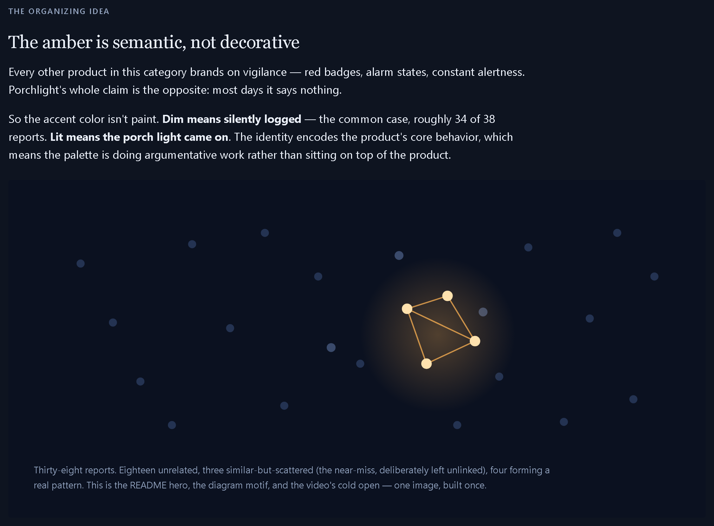

# Porchlight

**your friendly neighborhood agent**

A neighbourhood safety agent defined by how often it stays quiet.

Most services in this category alert on everything, and people learn to ignore them. Porchlight reads every report, correlates them by meaning rather than by keyword, and wakes a human only when several different neighbours have independently described the same situation in the same place over a short window. On the demonstration dataset, **thirty-four of thirty-eight reports are logged silently and never surface to anyone.**



Built for the AWS *Agents for Humans* hackathon, Good Neighbor track, on the [Strands Agents SDK](https://strandsagents.com).

---

## The problem it solves

Four neighbours notice the same person hanging around the same parcel lockers over a day and a half. They report it like this:

> "There has been a person hanging around the **mailboxes** the last couple of evenings."
> "Saw someone loitering by the **post boxes** again tonight when I got back from work."
> "Somebody was messing about near **where the packages get dropped** when I left this morning."
> "A person was waiting around by the **delivery lockers** early on again."

**Those four reports share no content word at all.** Any keyword or category filter sees four unrelated notes. A human moderator reading them a day apart sees four unrelated notes. The pattern is real and nobody is positioned to notice it.

Porchlight notices it, and — more importantly — declines to notice patterns that aren't there.

---

## What it does

Three agents, run as a sequential workflow.

```
report ─→ triage ──────────→ correlate ─────────────→ escalate ─→ alert
          Haiku 4.5          Sonnet 5                 Opus 5      or silent log
          classify           semantic_search               │
          redact             check_baseline_deviation      │
          normalise          get_zone_history              │
             │                     │                       │
             └── stored + indexed ─┴── evidence counted ────┘
                                        from storage
```

**Triage** classifies the report and rewrites it as one neutral sentence with every person-identifying detail removed. That sentence is the only long-lived version — the reporter's original words are held briefly, never indexed, and deleted on a retention timer.

**Correlation** searches for reports describing the same situation. Matching is semantic, so the four phrasings above find each other. It returns *which* reports are related and its reading of the evidence; it does not return counts.

**The pipeline counts the evidence** from storage — how many reports, how many *distinct* reporters, over what time span, across how many zones, and how unusual the rate is for that particular place.

**Escalation** weighs that evidence and decides. The decision lives in the agent's reasoning under its system prompt, never in an `if count > 3` branch, and every decision carries a required `reasoning` field that is shown on screen.

---

## The three behaviours worth watching

| | Evidence | Outcome |
|---|---|---|
| **The real cluster** | 4 reports · **4 different reporters** · one zone · 36 hours · z = 5.0 | **Alert** |
| **The near-miss** | 3 similar reports · 3 reporters · **three zones** · **21 days** | Declined |
| **The single reporter** | 4 similar reports · one zone · 3.5 days · **1 reporter** | Declined |

The second and third rows are the point. A system that only ever fires is not exercising judgment, and the declines are what make the alert worth reading.

The third row is also a safety control. Four reports from one person is not corroboration — it is one person's concern, and treating it as a neighbourhood pattern is how a service like this gets used against somebody.

---

## Setup

Requires Python 3.11+, an AWS account with Amazon Bedrock access, and roughly $1 of credit per full demo run.

```bash
git clone https://github.com/AminaZa/porchlight.git
cd porchlight

python -m venv .venv
source .venv/bin/activate          # Windows: .\.venv\Scripts\Activate.ps1
pip install -r requirements.txt

cp .env.example .env               # then edit it
```

> **First run downloads about 80 MB.** ChromaDB fetches the `all-MiniLM-L6-v2` ONNX embedding model and caches it. It looks like a hang; it isn't.

### Verify your model IDs before anything else

Bedrock serves Claude through inference profiles, so the IDs carry a routing prefix and are account- and region-specific. A guessed ID fails at the first call, and the failure looks like a credentials problem.

```bash
python -m src.provider --list
```

This prints the Anthropic profiles your account can actually use and flags any mismatch against what's configured. Set the three `FNA_MODEL_*` values in `.env` from its output. Model access also has to be granted in the Bedrock console for each model.

### Run one report first

```bash
python -m src.intake.cli "someone took my package from the porch" --zone "Elm St north"
```

This exercises auth, all three model IDs, structured-output parsing, persistence, and indexing in one shot. Do this before the full set — it's where configuration problems surface, and much easier to read there than on report 1 of 38.

### Then the demo

```bash
python demo/run_demo.py                        # the run
python demo/run_demo.py --explain              # + the reasoning behind each decision
python demo/run_demo.py --explain --html       # + a self-contained HTML report
```

---

## Design decisions

**Embeddings run locally.** ChromaDB's default function (`all-MiniLM-L6-v2` via ONNX) needs no API key, costs nothing per embedding, works offline, and returns identical output on every run. One less dependency, one less cost line, one less source of demo nondeterminism.

**Retrieval indexes the normalised sentence, not the raw report.** This was measured, not assumed. Indexing raw text put the weakest cluster report *below* an unrelated one — separation −0.03 to −0.16 across every query strategy tried, because incidental narration dominates the embedding of a short text. Indexing the normalised sentence separates the same groups by +0.28 to +0.52. Redaction and accuracy turned out to want the same thing.

**Anomaly detection is per-zone.** A count is compared against that zone's own history, never against other zones. Four reports in two days is unremarkable on a busy through-road and a genuine change in a quiet courtyard. Rates are Poisson, so deviation is measured in units of √rate rather than a sample standard deviation — a zone with a flat or empty history has zero sample variance, and those are exactly the quiet zones this is for.

**Persistence and dispatch are code, not tools.** An agent that skips a write leaves the report invisible to every later search, and nothing raises. An agent that calls `send_alert` with different values than the decision it just made has two sources of truth. The agents judge; the pipeline acts.

**Model per stage.** Haiku for typed extraction, Sonnet for tool selection, Opus 5 for the judgment. With prompt caching across the run this is roughly $0.90 per full 38-report run rather than $2.20.

---

## Privacy and safety

This is a system where residents report on neighbours, and where correlation *amplifies* what they report. The dominant failure mode of every product in this category is that "suspicious person" reports are the ones most prone to bias, and correlation can turn that bias into an official-looking alert. Four structural choices address it, and each makes the product better rather than merely safer.

**Correlation runs on place and behaviour, never on person descriptions.** Names, physical descriptions, vehicle details, and street numbers are stripped at triage and never reach storage or the index. Alerts describe *a place to watch*, not *a person to look for*.

**A cluster requires distinct reporters.** Counted from storage, not self-reported by the model, because a control a model reports on itself is not a control.

**A human approves before anything is dispatched.** `FNA_REQUIRE_APPROVAL=1` makes the agent draft and a person decide. Off for the demo; on for any real use.

**Raw report text expires.** Aggregates and the redacted sentence survive so the baselines keep working; the original words don't.

> **Not legal advice.** Before real residents use this, get advice on liability if an alert precedes a confrontation, and on whether the operator becomes a data controller under the applicable privacy regime.

The demonstration dataset is authored, not sampled. No public dataset contains multiple free-text descriptions of the same event by different reporters, because intake operators normalise that away at collection — and normalising it is precisely what this project automates. All zones are coarse labels; nothing resembling a real address appears anywhere.

---

## Tests

```bash
python -m pytest tests/ -q
```

19 tests, no AWS credentials required and no spend. Only the three model calls are stubbed — storage, retrieval, the anomaly detector, evidence computation, alert suppression, and the renderer all run for real.

The one to read first is `tests/test_vectors.py`. It asserts that the four differently-worded cluster reports outrank everything else, that a keyword search would fail on them, and that the near-miss stays separable from the genuine cluster. If that suite goes red, the project's premise is broken and nothing downstream matters.

---

## Repository layout

```
src/
  models.py      the data contract; model-generated fields split from computed ones
  provider.py    model per role, prompt caching, `--list` to verify Bedrock ids
  prompts.py     the three system prompts, together, because they tune together
  agents/        triage · correlation · escalation
  tools/         storage · vectors · anomaly · alerts
  pipeline.py    the workflow, and where evidence is counted
  render.py      SQLite → one self-contained HTML file
data/            the demonstration dataset
demo/            the run
tests/           19 tests, offline
```

`PROJECT_BRIEF.md`, `IMPLEMENTATION_PLAN.md`, `BRANDING.md`, and `PROGRESS.md` are the working documents, kept in the repository because the reasoning behind the decisions is part of the submission.

---

## License

MIT — see [LICENSE](LICENSE).
